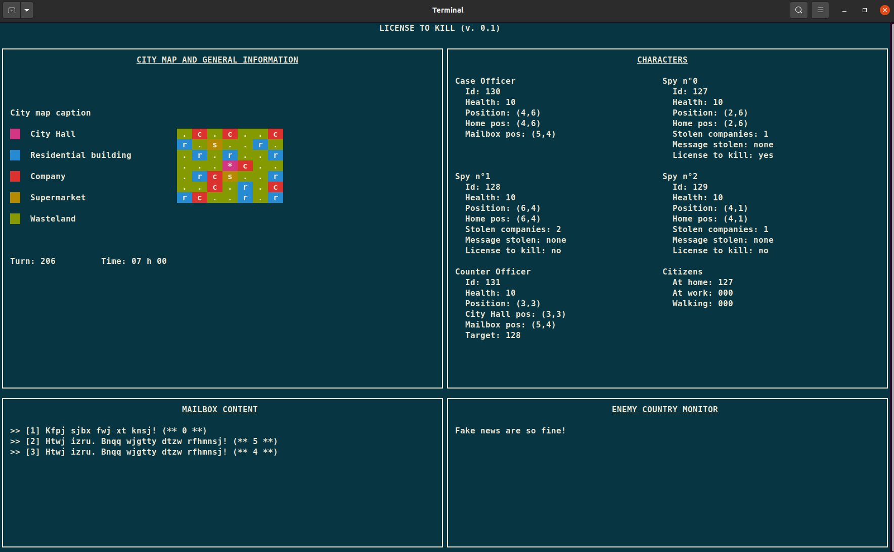

# Resources for the "License to kill" project 

## Monitor program

The *ncurses* TUI (*Terminal User Interface*) will give better results using 
The "Meslo LG L for Powerline" font that should already be installed. The font
can also be downloaded at [https://github.com/powerline/fonts](https://github.com/powerline/fonts).

## Others resources
 
- An interesting C language guide: [Beej homepage](https://beej.us/guide/bgc/html/split/index.html)
- Coding style: see [here](https://projectacrn.github.io/latest/developer-guides/c_coding_guidelines.html#c-ty-08-the-struct-field-type-shall-be-consistent)
- Memory queue functions for MacOSX came from [Stanislav Pankevich](https://github.com/stanislaw/posix-macos-addons)'s repositery.

